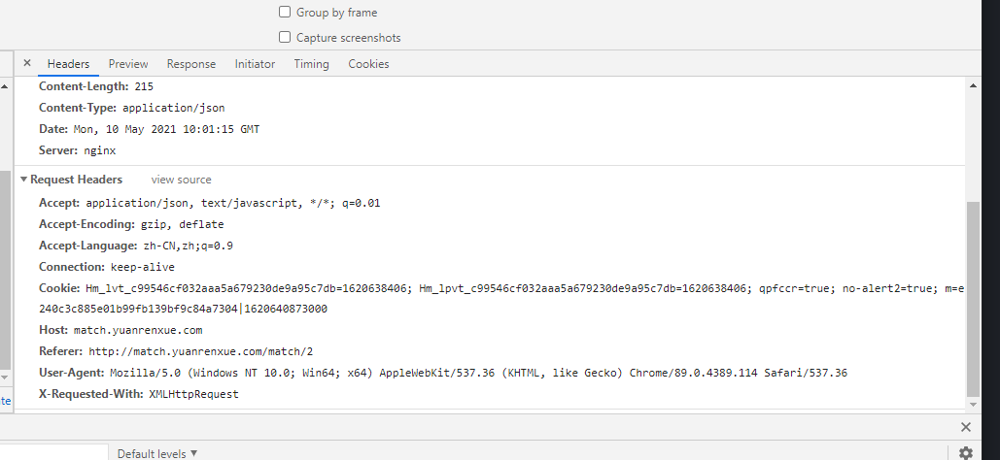

# 猿人学第二题
```text
计算五页的热度值的加和
```
## 抓包分析
按第一题的套路，直接可以找到请求数据的接口`api/match/2`，查看接口请求的数据，会发现除了第几页之外，就没有其他参数了。

再检查请求的headers，会发现在cookie里有一个叫`m`的参数

这个的值看起来就像是一个加密后的值加上一个时间戳
再请求几页会发现这个值是不断变化的，这个应该就是关键的参数了，剩下的就是找出`m`是怎么生成的了。
---
## 关键参数`m`的生成
cookie中的参数有两种生成方法：
- 服务器返回
  
    使用这种方式，则在请求一页数据的请求之前，必然有一个请求会在response的headers里返回一个`set-cookie`参数，其中包括了`m`的值。
  
    对于这种方式，需要检查请求数据之前的请求里的`set-cookie`参数，找到`m`是在哪个请求里被设置的，再模拟那个请求即可。
- 本地的代码生成；

    使用这种方式，在请求一页数据的请求之前，必然会有一个请求返回的数据里，包括了生成`m`的入口函数。

    对于这种方式，往往返回的js代码都是经过混淆的，很难直接通过搜索`m=`或者`m:`找到入口函数，可以尝试通过搜索`m`里存在的一些固定的标志性字符，如：`|`等来提高搜索效率。
还有一种方法就是通过hook的方法，在生成`m`这个参数之前断点，然后注入js代码，在cookie中出现`m=`的时候断点，通过回溯调用栈找到入口，注入代码如下：
```javascript
(function (){
    Object.defineProperty(document, 'cookie', {
        set: function (cookie) { 
            if(cookie.indexOf('m=') > -1){
                debugger;
                return cookie
            }
        }
    })
})()
```

对于这道题，分析请求会发现，cookie中的参数`m`在请求题目页面的时候就已经出现了，也就是说在我们一开始可能漏了一些包，新开一个无痕窗口，重新用fiddler抓一下包，对比前面的抓包记录，会发现对于题目页面的url`http://match.yuanrenxue.com/match/2` ，实际发起了两次请求，第一次请求返回了一段混淆后的js代码，第二次请求返回的就是正常的网页，而且请求的`cookie`里已经带上了`m`这个参数，而在第一次发起的请求里，返回的包也没有`set-cookie`参数，说明`m`应该就是在第一次返回的那段代码里生成的了。

把第一次请求返回的混淆后的js代码放到解混淆工具里解混淆后再看，在代码的最后面就能看到这样一个方法
```javascript
  function W(Y, Z) {
    document["cookie"] = "m" + M() + "=" + V(Y) + "|" + Y + "; path=/";
    location["reload"]();
  }
  
    function X(Y, Z) {
    return Date["parse"](new Date());
  }

  W(X());
```
果然和前面想的一样，`m`参数就是在这里生成的，其中调用的M函数、V函数和传入V函数的参数Y也都很清楚的能在这里看到，实际就是将时间戳经过v函数处理后的值和时间戳拼起来；
这里比较奇怪的是M函数，因为通过抓包是能看见cookie的参数就是叫`m`，后面没有再接上什么了，而这里还加上了一个M函数，有可能M函数不返回值，但是在执行M函数的时候，会给一些后面V函数需要用到的参数赋值，因此还要再看一下M函数的代码做了什么，代码如下：
```javascript
function M(Y, Z) {
    var a4 = B(this, function () {
      var a6 = function () {
        var a7 = a6["constructor"]("return /\" + this + \"/")()["compile"]("^([^ ]+( +[^ ]+)+)+[^ ]}");
        return !a7["test"](a4);
      };

      return a6();
    });
    a4();
    K();
    qz = [10, 99, 111, 110, 115, 111, 108, 101, 32, 61, 32, 110, 101, 119, 32, 79, 98, 106, 101, 99, 116, 40, 41, 10, 99, 111, 110, 115, 111, 108, 101, 46, 108, 111, 103, 32, 61, 32, 102, 117, 110, 99, 116, 105, 111, 110, 32, 40, 115, 41, 32, 123, 10, 32, 32, 32, 32, 119, 104, 105, 108, 101, 32, 40, 49, 41, 123, 10, 32, 32, 32, 32, 32, 32, 32, 32, 102, 111, 114, 40, 105, 61, 48, 59, 105, 60, 49, 49, 48, 48, 48, 48, 48, 59, 105, 43, 43, 41, 123, 10, 32, 32, 32, 32, 32, 32, 32, 32, 104, 105, 115, 116, 111, 114, 121, 46, 112, 117, 115, 104, 83, 116, 97, 116, 101, 40, 48, 44, 48, 44, 105, 41, 10, 32, 32, 32, 32, 32, 32, 32, 32, 32, 32, 32, 32, 125, 10, 32, 32, 32, 32, 125, 10, 10, 125, 10, 99, 111, 110, 115, 111, 108, 101, 46, 116, 111, 83, 116, 114, 105, 110, 103, 32, 61, 32, 39, 91, 111, 98, 106, 101, 99, 116, 32, 79, 98, 106, 101, 99, 116, 93, 39, 10, 99, 111, 110, 115, 111, 108, 101, 46, 108, 111, 103, 46, 116, 111, 83, 116, 114, 105, 110, 103, 32, 61, 32, 39, 402, 32, 116, 111, 83, 116, 114, 105, 110, 103, 40, 41, 32, 123, 32, 91, 110, 97, 116, 105, 118, 101, 32, 99, 111, 100, 101, 93, 32, 125, 39, 10];
    eval(L(qz));

    try {
      if (global) {
        console["log"]("\u4EBA\u751F\u82E6\u77ED\uFF0C\u4F55\u5FC5python\uFF1F");
      } else {
        while (1) {
          console["log"]("\u4EBA\u751F\u82E6\u77ED\uFF0C\u4F55\u5FC5python\uFF1F");
          debugger;
        }
      }
    } catch (a5) {
      return navigator["vendorSub"];
    }
  }
```

乍一看就感觉这个函数不是什么好函数，前面调用了两个函数，但是又不赋值给任何变量，后面又调用了一次eval方法，执行了一段js代码，最后还无限调用console.log方法输出内容，感觉这个方法就是用来妨碍我们的，应该可以直接删掉。

但是这里留了一个坑，就是在这个函数里声明了一个变量`qz`，这个变量除了在函数内部被引用以外，还在下面的N函数里也被引用了，如果把这个变量删掉的话，虽然代码可以执行，但是最终得到的结果就始终都不能通过验证了，应该把这个qz单独保留下来再删掉M函数。

以后在抠代码的时候也要多留意一下，看看是不是有变量是在其他地方也有引用的，最好还是尽量保留原来的代码，只要对代码执行没有影响，就可以保留下来。
