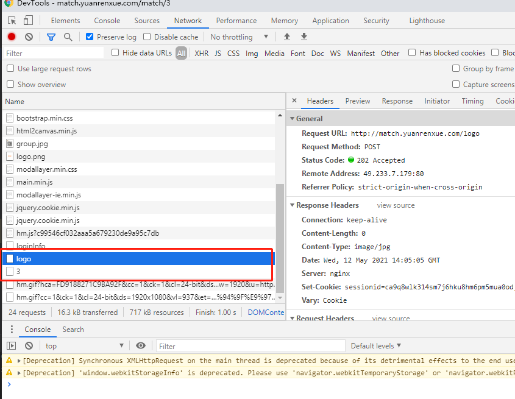

# 猿人学第三题
```text
把五页中出现频率最高的申请号找出来
```

## 抓包分析
按照前两题的套路，一样先抓包，找到api/match/3这个包，查看返回的包确实数据就在这里，再接着看请求的内容，请求的参数只带了一个表示页数的`page`，headers里也只有cookie里带了一个sessionid比较特别，其他都没有什么特别的了。

翻几页看看，会发现每次翻页之后，在api/match/3这个请求之前都会请求一次logo这个url,而且还是个post请求

从api/match/3的调用栈回溯一下，会看到在`request`方法里，设置了一个`beforeSend`对象，查了一下，ajax里的beforeSend就是在异步请求前再发送一个请求用的
那看来这题的关键点就是在这里了

也就是说每次请求api/match/3之前，都要请求一次logo，返回的包里会设置一个sessionid，带上这个sessionid就能请求成功了。
再看到logo这个请求里，也没有什么特别的参数，那基本上就没有什么问题了，可以直接写代码。

因为每次请求都要带有cookie，所以可以开一个session来保持会话

## 踩到的坑

他竟然还要校验headers里的参数的顺序。。
一定要Host在第一个才行。
这里要注意的是，python本身的字典是无序的，因此需要用到collections里的OrderedDict来构建有序字典，或者直接设置`session.headers`，这个本身也是一个有序字典
从调试工具复制headers的时候，要点一下`view source`显示回原始的格式，否则参数顺序就错了。
