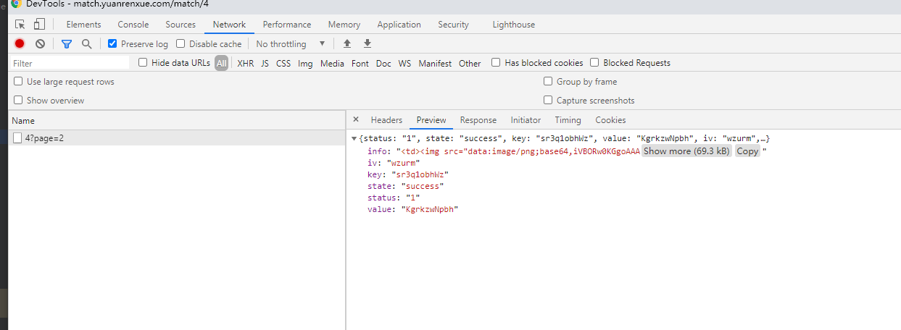
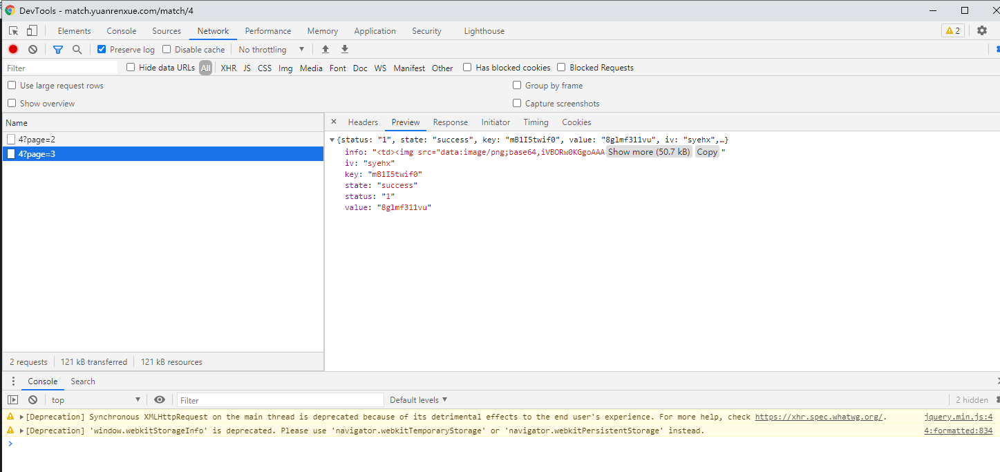
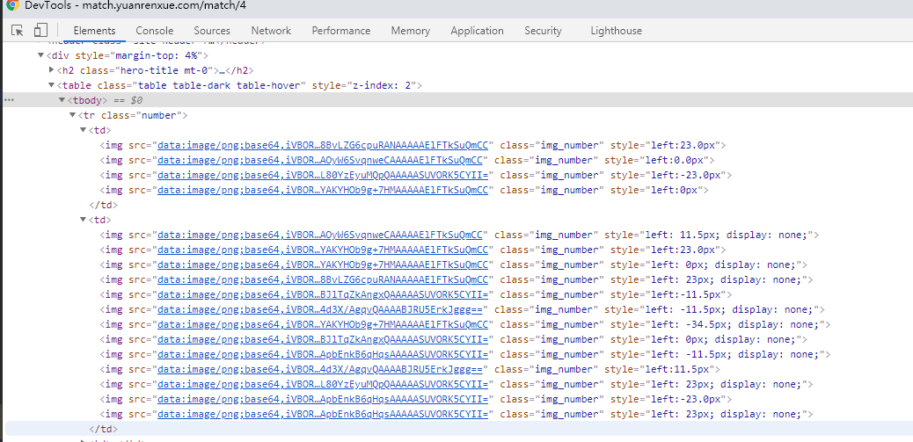
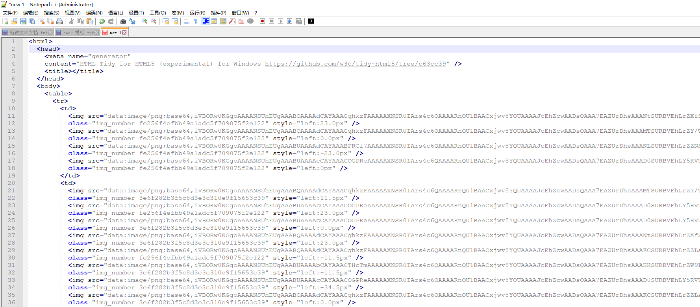
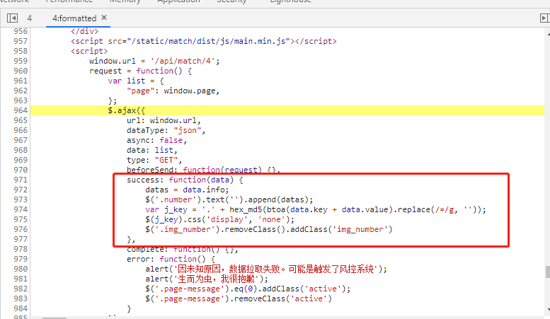
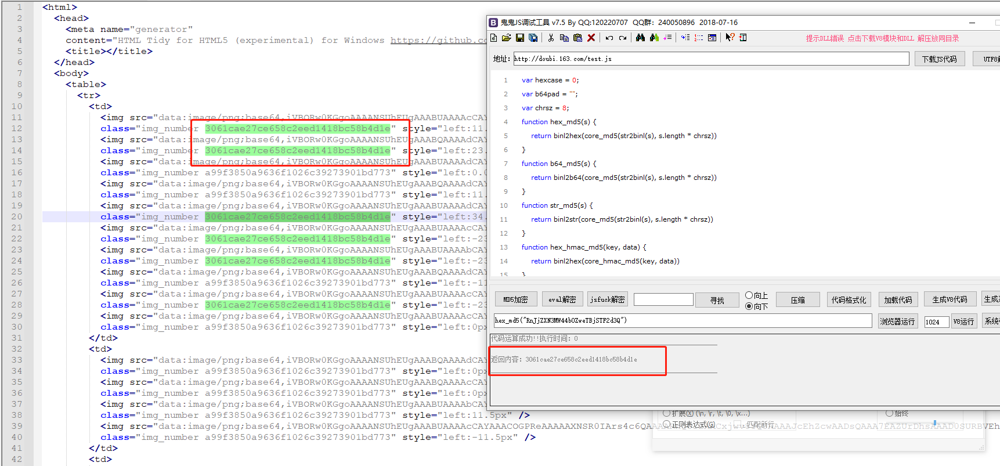
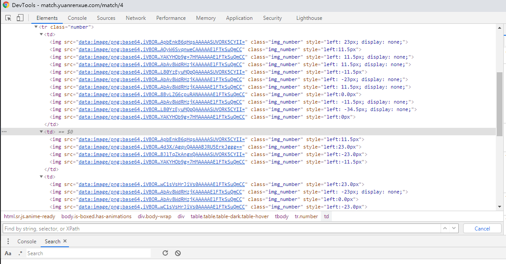
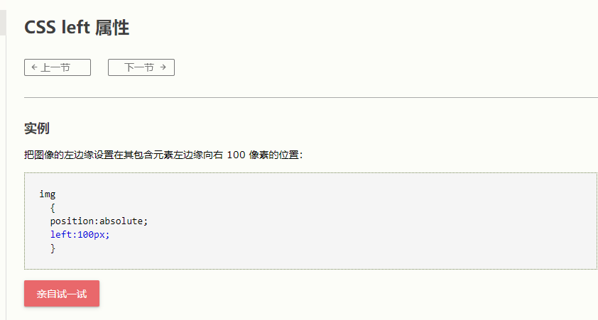
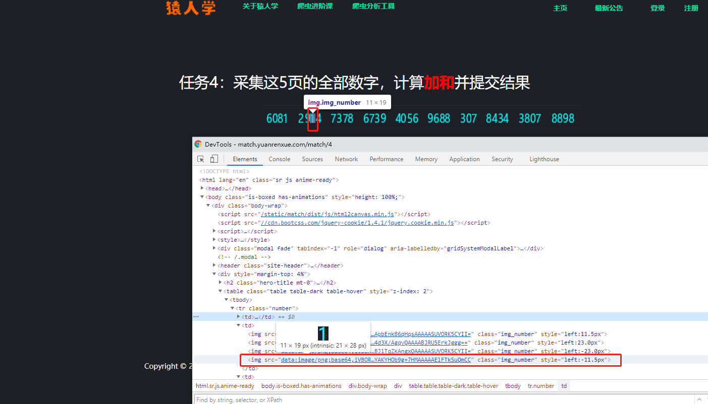
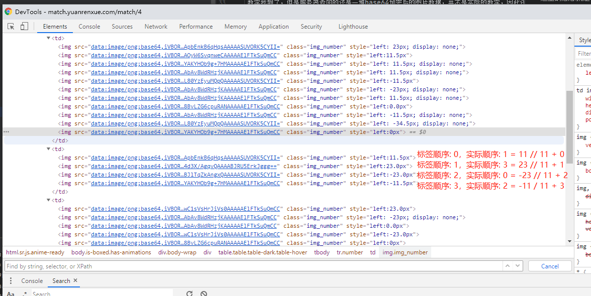

# 猿人学第四题
```text
获取数据，计算加和
```

## 抓包分析
按惯例，抓包后找到`api/match/4`这个包，首先看一下请求的参数，只有一个`page`，headers里也没有什么特别的参数，那看来这题的重点就不在参数的构造上了。

再看下返回的数据

好像跟平时的不太一样啊...
返回的数据里面没有以往的data列表，反而返回了一个`info`变量，里面还存了一堆html代码，看标签还是一堆图片..
再接着还有一堆`iv`、`key`、`value`的变量，也不知道是什么。

再换一页看看

返回的还是这样的数据，而且也没有其他包发送了，那应该就是返回的这一堆东西在前端做了处理之后显示出我们看到的样子了

点到调试器的`Elements`标签，找一下数据出现的地方，会看到下面这样的代码

这个看起来就很像抓到的包里返回的`info`的内容了，再和抓到的数据对比一下

对比一下就能发现img标签里base64编码的内容是一致的，唯一不同的地方是浏览器里的很多标签都被设置了属性`display: none`，而这个是在返回的代码里没有的，应该是后面再加上的。
再从异步加载的调用栈看看请求成功后做了什么吧

可以看到在请求成功后，程序把请求回来的`key`和`value`做了一个拼接，然后再进行了一次md5加密，再做了一个正则的替换，然后选取包含最终得到的结果的标签，把他们的属性`display`改成了`none`
那么应该就是在这里把img标签的属性进行修改的，每个img标签里都有一个class属性，里面的`img_number`后面就接了一串看起来就像是md5加密的东西，把它调用的加密函数抠出来试一下就能确定了。

把代码抠出来再把`key`和`value`放到函数里调用一下

可以看到结果确实是能和返回的html代码里匹配上的，也就是说这些匹配上的都是不要的，剩下的就是构成数值的每个数字了

数字找到了，但是服务器返回的还是一堆base64加密后的图片数据，并不是实际的数字，因此还要解决图片转化为数字的问题

如果我们认真观察一下我们抓到的包，就会发现所有数字的图片只有在第一次打开的时候才进行了一次请求，后面点击其他页面，都没有再发起图片数据请求，而且每次重新请求图片数据，base64编码都看起来是一样的，那有没有可能这些图片都是固定的base64编码呢？
可以刷新几次同一个页面来验证一下，通过对比同一个数字的base64编码，可以看到确实就像我们想的那样，每次的图片都是一样的，那就简单啦，只需要维护一个字典来进行匹配就好了。
--- 
## 遇到的坑
通过上面的分析，我们理清了返回的数据的意义，以及每一个数字怎么从base64编码的图片转换成实际数字，那基本上这题就解决了，但是当我们写完代码跑一次之后就会发现，返回的html里还挖了一个坑，就是返回的代码中每张图片所处的位置和它实际显示的位置不一定是一样的，也就是说我们还要再对数字的顺序进行一下调整，才能得到正确的数。

既然网页上显示的顺序是正确的，而且请求成功后，也没有再对html代码做除了设置`display`外的其他操作，那应该就是html代码本身就对图片的位置进行了处理了，那就再看回网页代码找找

可以看到每一个img标签的`style`里都设置了一个`left`值，查一下看看这个`left`是做什么用的

这里的意思就是，`left`属性定义了图片离包含这个图片的标签（在这里是img标签）的左边界的距离，如果是负数的话，就表示在左边界的左边。
对照网页上的图片会比较好理解，像下面这张图里，数字1的图片是第四个img标签，而他的left属性是一个负值，也就是在第四个img标签的左边界的左边-11.5px的位置

这样的话我们还需要再找到每张图片实际的位置和left参数之间的关系，把顺序做一下变换才能得到正确的数值。
找几个数字看一下他们的规律，可以找到下面图里的规律

即: `实际下标 = 偏移量(left) // 11 + img标签下标`
再找几个验证一下，就能确定这个算法对不对了

转换顺序后数据就成功取到啦，搞定。
