# 猿人学第四题
```text
抓取5页的热度，把前五名的热度求和
```
## 抓包分析
打开网页之后，一打开浏览器的调试器，就会看到控制台一直在输出一句话
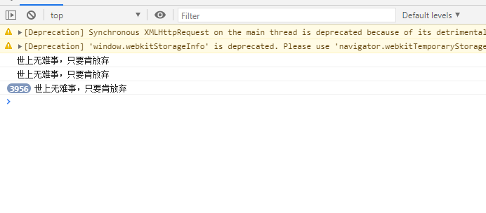
如果不去管它的话，很快就会把内存占满，直接卡死了，要跳过这个可以把`console.log()`给hook掉，先在尽量前的js代码里下一个断点，然后在控制台执行这段代码就ok了
```javascript
(function () {
    console._log = console.log;
    var _log = function (arg) {};
    Object.defineProperty(console, 'log', {
        value: _log
    })
})();
```
然后就可以开始抓包啦。\
直接找到`api/match/5`这个包，可以看到请求里带了两个参数`m`和`f`，而且两个一看就是时间戳，再看cookie里，也有两个特别的参数，一个也叫`m`，还有一个叫`RM4hZBv0dDon443M`，看起来应该是一个base64加密的字符串。
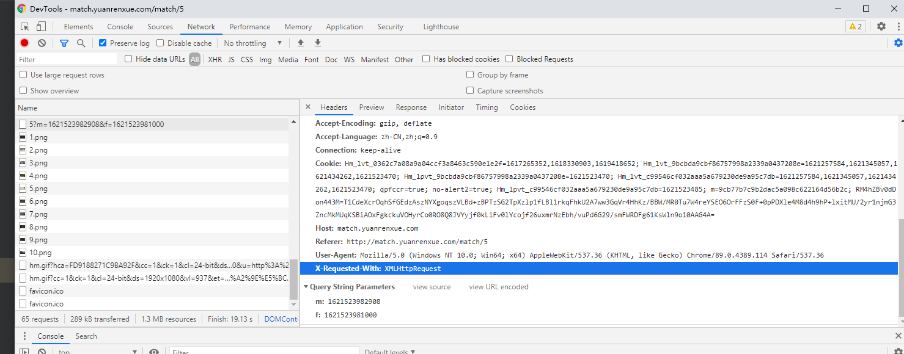
从接口的调用栈找回构造请求的函数，我们可以看到请求的参数`m`和`f`分别取了window的一个属性的值
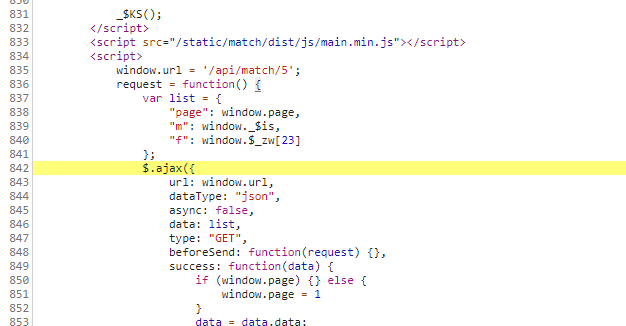
在调试器里搜一下，发现除了赋值给参数之外，没有其他地方再出现了，应该是做了混淆了，但是前面看了请求的内容，这两个都是时间戳，应该是和cookie里的两个参数有关联，应该就是cookie的两个参数要么是根据这两个参数生成的，要么就是这两个参数是生成的参数的一部分。
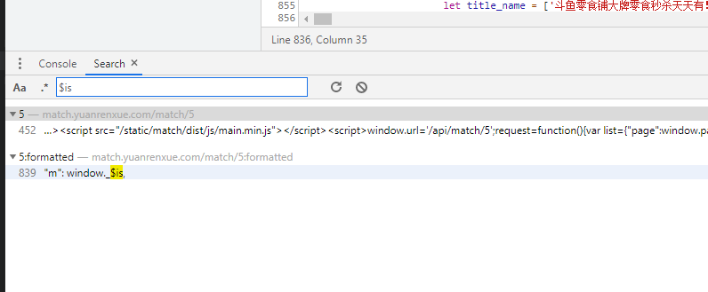
那就再看看cookie里的两个参数吧。
先直接搜一下`RM4hZBv0dDon443M`这个参数，因为`m`的话出现的频率太高了，很难搜到。
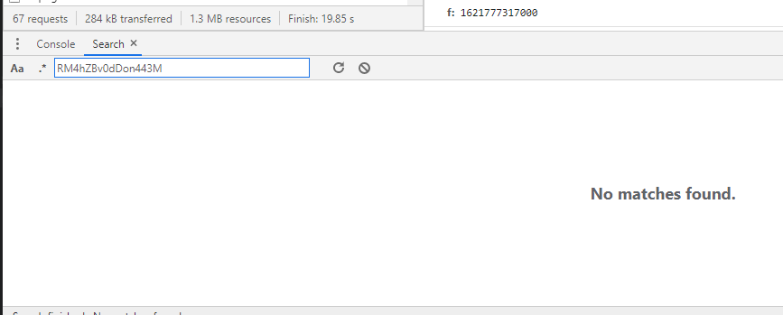
发现也是搜不到的，应该也是做了混淆了，hook一下看看。
在调试器注入这段代码
```javascript
(function () {
    'use strict';
    Object.defineProperty(document, 'cookie', {
        set: function (data) {
            if (data.indexOf('RM4hZBv0dDon443M=') > -1) {
                debugger;
            }
            return data;
        }
    });
})()
```
成功hook到了！
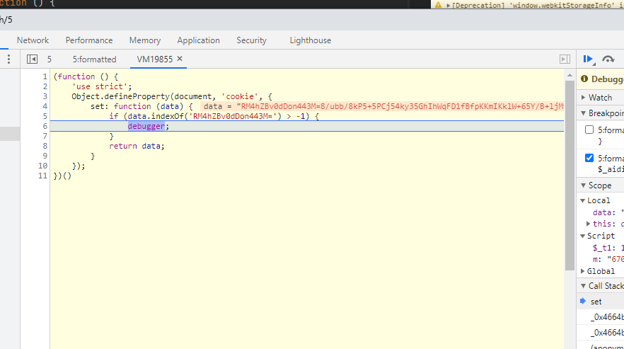
再从调用栈回溯一下，找到cookie生成的地方了，有毒，还把参数名拆成一个个字符拼起来。
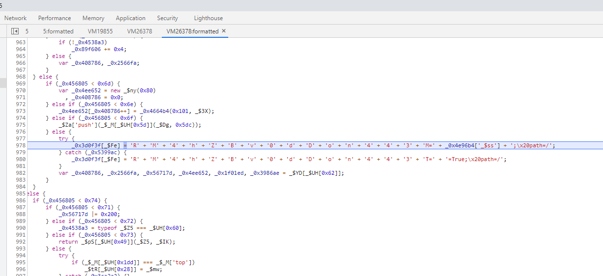
从这个方法里看，`RM4hZBv0dDon443M`是`_0x4e96b4['_$ss']`这个变量的值，把鼠标移到`_0x4e96b4`上面，可以看到这个变量就是`window`变量，也就是`RM4hZBv0dDon443M = window._$ss;`。\
ok，接下来再看看`window._$ss`这个变量是怎么生成的。
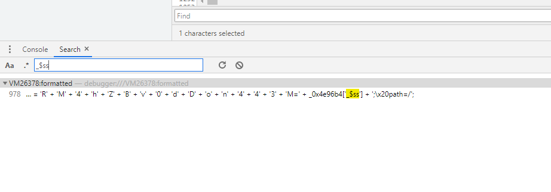
同样也是搜不到变量生成的地方，应该也是做了混淆的，再hook一下看看。
hook之后定位到了这里
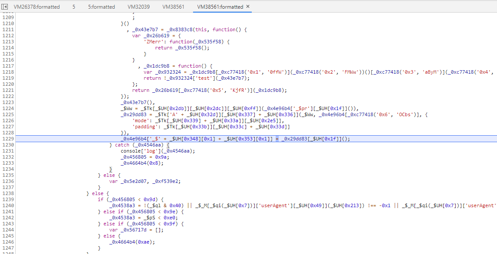
把`'_$' + _$UH[0x348][0x1] + _$UH[0x353][0x1]`放到console里，就能看到这个直接拼接成了`_$ss`，而且可以看到他是把`_0x29dd83[_$UH[0x1f]]()`这个的值赋给了`window._$ss`，我们知道`window._$ss`是一个字符串，那大概率这里就是调用了`toString()`方法了，所以我们只需要搞定`_0x29dd83`就行啦。\
往上看我们就能看到`_0x29dd83`是怎么被赋值的：
```javascript
_0x29dd83 = _$Tk['A' + _$UH[0x32d]][_$UH[0x337] + _$UH[0x336]](_$Ww, _0x4e96b4[_0xc77418('0x6', 'OCbs')], {
    'mode': _$Tk[_$UH[0x339] + _$UH[0x33a]][_$UH[0x2e5]],
    'padding': _$Tk[_$UH[0x33b]][_$UH[0x33c] + _$UH[0x33d]]
})
```
查找一下`_$TK`这个对象，我们可以在这个文件里找到它的定义，就是一个`CrytoJS`对象，把后面这些混淆拼接的内容解混淆一下
```javascript
_0x29dd83 = _$Tk['AES']['encrypt'](_$Ww, _0x4e96b4["_$qF"], {
    'mode': _$Tk["mode"]["ECB"],
    'padding': _$Tk["pad"]["Pkcs7"]
})
```
就能看到这里就是使用了`CrytoJS`的AES加密进行了处理，加密的mode和padding都已经在这里写明了，那么我们只用再解决text和key是怎么来的就好了\
`CrytoJS`的加密调用方式是
```javascript
CrytoJS.AES.encrypt(text, key, {
    'mode': CrytoJS.mode.ECB,    // 加密模式
    'padding': CrytoJS.pad.Pkcs7,   // 填充方式
    'iv': CrytoJS.enc.Utf8.parse(iv)}) // 偏移量
```
也就是我们看到的代码里，`_$ww`就是加密的text，`_0x4e96b4["_$qF"]`就是key，那就一个个解决吧。
### AES加密的text
我们可以在执行加密操作的代码的上一行看到`_$ww`的赋值过程:`_$Ww = _$Tk[_$UH[0x2db]][_$UH[0x2dc]][_$UH[0xff]](_0x4e96b4['_$pr'][_$UH[0x1f]]())`，解混淆之后，可以看到他是直接调用了`CrytoJS`的parse方法把`_0x4e96b4['_$pr'][_$UH[0x1f]]()`这个对象进行了处理，根据前面的经验，`[_$UH[0x1f]]()`就是`toString()`方法，看一下`_0x4e96b4['_$pr']`的内容，发现它是一个数组，存了几个看起来是加密过的字符串
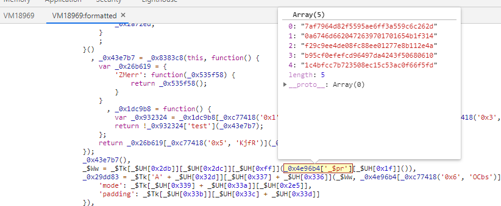
所以我们要做的就是找到这个数组的元素是什么，搜一下这个变量，会发现这个变量一共出现了7次，除去这里调用的一次和最开始初始化的一次，剩下五次里四次是往里面放东西的，还有一次是把这个数组删除的操作，这里应该是触发了风控才会进到的地方吧，那就在push的四个位置都下断点，看看放进去的是什么东西。\
下完断点，再翻一下页看一下，直接断在了这个位置
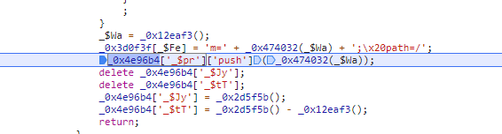
这时候去看`_0x4e96b4["_$qF"]`的话，会看到它是空的，也就是说这里是第一次放内容进去的地方，分析一下上下语句，可以看到这里取了一个时间戳，并把这个时间戳赋值给了`_$Wa`，然后把`_0x474032(_$Wa)`的结果push进了数组，而且在这之前，我们还能看到它把这个结果赋值给了cookie的`m`，这样一来cookie里的另一个参数`m`我们也知道是怎么来的了，但是我们还不清楚这个时间戳和请求参数里的时间戳`m`和`f`有没有什么关联，还是随便取一个都可以，所以我们可以把这个值先记录下来，等请求完再和请求的参数对比一下。\
继续往下跳断点，接下来连续4次都是进到同样这个地方，而到了第五次的时候，就又跳到了一个新的位置
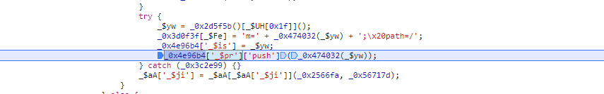
对比前面，这个位置除了更新cookie里m的值外，还设置了`_0x4e96b4['_$is'] = _$yw;`，我们知道`_0x4e96b4`就是`window`对象，也就是说这里设置了`window._$is`的值，而这个值最终是被赋给了我们请求参数里的`m`的，那我们之前的猜测就被证实了，请求的参数和cookie里的参数确实是有关联的，而且cookie里的两个参数都和`m`有关系，那么剩下的就是`f`还没有出现了，我们继续看下去，如果一直都没有出现和`f`相关的代码的话，那`f`应该就只是一个普通的时间戳，我们直接生成就行了。\
当我们走完全部流程后，会发现始终都没有`f`相关的代码出现，那应该`f`就是一个普通的时间戳，并没有参与到cookie相关的运算里面，我们抓包的时候会发现cookie是有有效期的，有可能这个`f`就是用于有效期的计算的，我们可以先直接生成一个试试，看看会不会有什么问题。\
走完一次流程后，`_0x4e96b4['_$pr']`是如何构成的我们就清楚了，一共是5个时间戳，经过同一个函数`_0x474032()`的处理后得到的字符串就是整个数组的构成，其中最后一个时间戳是我们请求的参数`m`。这样的话，AES加密的text我们就搞定了，剩下的就是key了。
### AES加密的key
从前面我们知道，加密的key是`_0x4e96b4["_$qF"]`，同样我们可以用hook的方法断点下来，然后回溯一下就能找到它被赋值的地方了。
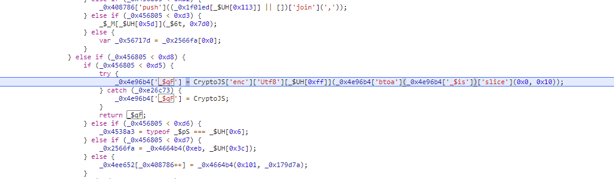
有了前面分析text的基础，这里就很清楚了，把`_0x4e96b4['_$is']`（也就是我们请求的参数`m`）做一次base64编码，然后调用`slice()`方法处理一下，再给`CrytoJS`的`parse`方法处理就搞定了。
查一下百度，`slice()`方法就是取子串，也就是python里的切片方法，那就简单啦。
### 总结
整理一下整个请求的参数生成逻辑

1. 生成两个时间戳`m`和`f`，其中`m`是1621924420663这种格式的，`f`是1621924420000这种格式的
2. 再生成4次`f`格式的时间戳，并传给`_0x474032()`这个函数加密，加密的结果放到数组里（因为前面4次的时间戳只传了加密的结果，没有传明文给服务器，所以猜测前面4次的内容是不进行校验的，真正有用的只有最后一次的`m`值，所以前面这里可以试试直接写死），然后再把`m`传给`_0x474032()`加密，一样加密的结果放到数组中，同时这个加密的结果也是cookie中的`m`
3. 调用数组的`toString()`方法把数组转换成字符串，然后传给`CrytoJS.enc.Utf8.parse()`方法，就得到了加密的text
4. 把`m`进行一次base64编码，然后截取前16位，同样把结果传给`CrytoJS.enc.Utf8.parse()`方法，就能得到加密的key
5. 调用`CrytoJS.AES.encrypt()`方法，加密模式为ECB，填充方式为Pkcs7，把加密的结果toString一下，就能得到cookie中的`RM4hZBv0dDon443M`
6. 把cookie的值更新上去，然后请求里也带上`m`和`f`两个时间戳，就构成完整的请求了。

那么剩下的就是抠代码，写代码了。

## 需要注意的点

- CrytoJS是javascript的一个第三方库，需要提前安装，然后在js文件里手动导入
- 把生成`_0x4e96b4['_$pr']`，也就是时间戳数组的相关代码抠下来就可以了，调用CrytoJS的代码需要我们自己写
- 题目只需要前五的热度和，不要加多了

